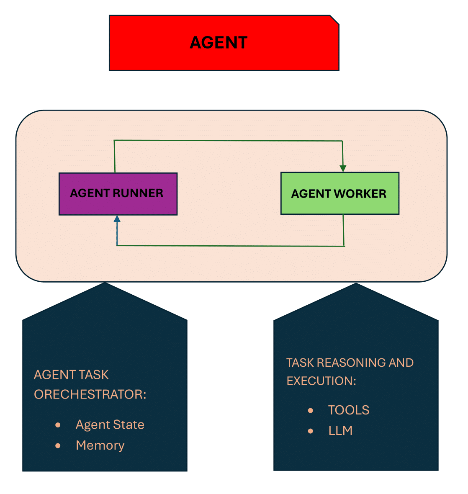

# RaidenX-AGENT

## Introduction

RaidenX Agent consists of two main components: Agent Runner and Agent Worker. These components interact cyclically until a final response is reached. The Agent Worker performs the actual work of tool selection through reasoning via chain of thoughts and decides the next step or formulates the final output. Meanwhile, the Agent Runner acts as an orchestrator responsible for maintaining task state and memory buffer. It functions as a scheduler and dispatcher.

The image below illustrates the Agent Reasoning Loop with Agent Components and their roles.



## Control Flow

To understand the workflow, we need to understand chain of thoughts. To break down a complex task into subtasks, LlamaIndex Agent utilizes chain of thought to guide the LLM in deciding the next action. These chains of thought are introduced by templates with a set of fixed prompts and dynamic context relevant to the current step.

The diagram below shows the sequence of events in an AGENT REASONING LOOP


## How to Run

```bash
docker compose up --build -d
```
